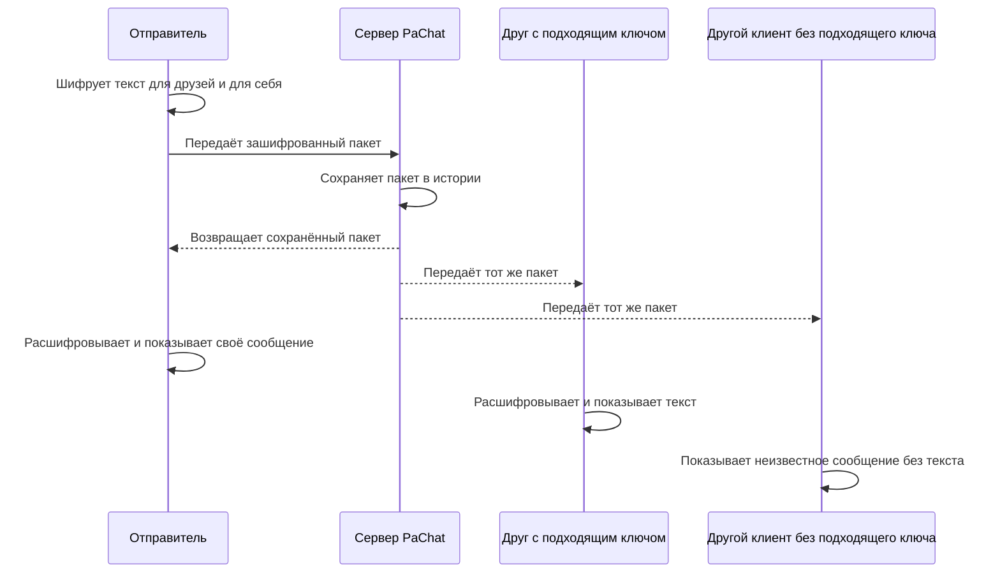
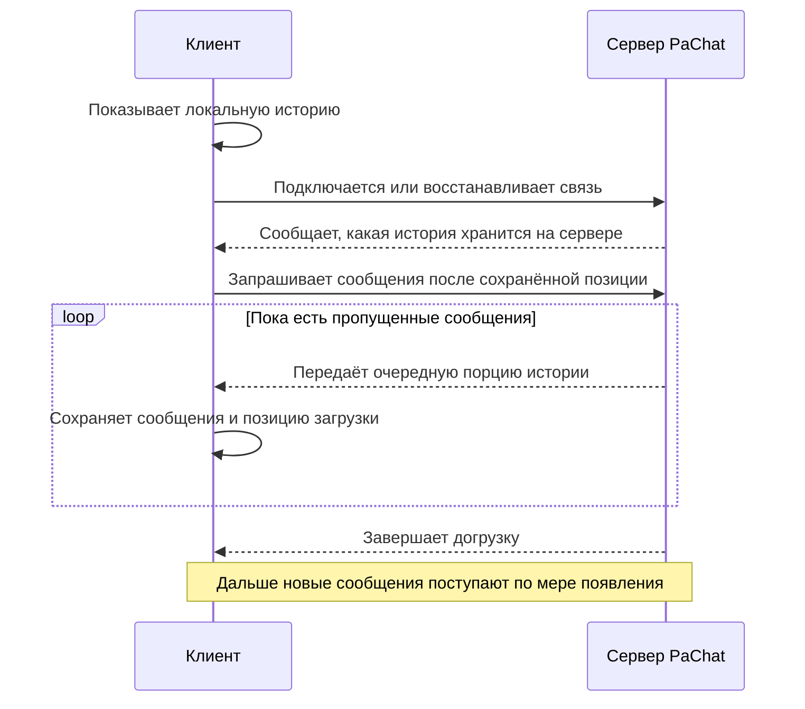

# PaChat

PaChat — экспериментальное приложение для обмена зашифрованными текстовыми сообщениями через собственный сервер. Клиент работает на Android и Windows. Сервер хранит зашифрованные сообщения и передаёт их клиентам; расшифровка происходит на устройствах пользователей.

В приложении нет серверных аккаунтов, регистрации и списка пользователей. Имена друзей, ключи и настройки хранятся в локальном профиле. Для начала общения участники подключаются к одному серверу и обмениваются открытыми ключами через удобный внешний канал.

## Основная идея

Сервер не выбирает получателя: он рассылает каждый зашифрованный пакет всем подключённым клиентам. Прочитать содержимое могут только те, для чьих ключей отправитель зашифровал сообщение.

В текущей версии каждое сообщение отправляется сразу для **всех добавленных открытых ключей друзей**, а также для самого отправителя. Это общая лента сообщений, а не набор отдельных личных диалогов. Если ключей друзей ещё нет, сообщение сможет прочитать только отправитель.

## Как передаётся сообщение

Сначала сервер сохраняет сообщение и только затем рассылает его. Отправитель добавляет сообщение в свою историю после получения пакета обратно от сервера. Отдельных отметок о прочтении или получении собеседником пока нет.

## Как начать общение

1. Запустите сервер на компьютере, доступном участникам. Инструкции находятся в [описании сервера](server/README.md).
2. Откройте клиент и укажите адрес и порт этого сервера. Для телефона нужен доступный по сети адрес компьютера с сервером.
3. Добавьте друга в разделе **Friends**. Приложение создаст ключи для этой записи.
4. Передайте другу свой открытый ключ кнопкой **Share public key** или **Copy key**. Получив этот ключ, друг сможет отправлять сообщения, которые вы сможете расшифровать.
5. Получите открытый ключ друга и добавьте его в ту же карточку через **Add friend's key**. Теперь вы можете отправлять сообщения друг другу.

Открытыми ключами можно делиться. Закрытые ключи остаются на устройстве и нужны для чтения сообщений. Сервер PaChat не участвует в обмене ключами.

На Windows можно создавать разные локальные профили, например Alice и Bob. У каждого свои друзья, ключи, настройки и история. На Android приложение использует постоянный профиль устройства без отдельного экрана выбора. При наличии сохранённых настроек подключение начинается автоматически.

## История и восстановление связи

Клиент сразу показывает сохранённую на устройстве историю, даже если сервер временно недоступен. После подключения он запрашивает все пропущенные сообщения небольшими порциями. Если связь оборвалась во время загрузки, синхронизация продолжается при следующем подключении; повторно полученные сообщения не дублируются.

История сохраняется и на сервере, и у клиента в зашифрованном виде. Перезапуск сервера с той же базой не стирает сообщения. Если сервер начинает работать с новой базой, клиент хранит её историю отдельно от прежней. Старые клиентские кеши с возможными пропусками пересинхронизируются автоматически.

При ошибке сохранения клиент показывает предупреждение и позволяет повторить запись. До успешного сохранения новые сообщения остаются только в памяти клиента и в истории сервера.

## Что работает в фоне

Обработка сообщений не зависит от открытого экрана чата. На Android можно вернуться с экрана чата к экрану подключения: пока процесс приложения работает и соединение доступно, сообщения продолжают приниматься и сохраняться. После потери связи клиент пытается подключиться снова, а при возвращении в приложение обновляет соединение.

**Это пока не полноценная фоновая доставка Android.** Система может приостановить или завершить приложение. Push-уведомления ещё не подключены; в таком случае пропущенные сообщения будут загружены при следующем успешном подключении.

Работа Windows-клиента в трее и системные уведомления также запланированы на будущее. Сейчас выход из профиля закрывает его соединение.

## Ключи, резервные копии и ограничения

Ключи защищаются средствами операционной системы. В разделе **Friends → Encrypted backup** можно создать защищённую паролем резервную копию ключей и затем восстановить её. История сообщений в эту копию не входит. Для чтения зашифрованной истории необходимы соответствующие закрытые ключи.

PaChat пока является прототипом. Несколько особенностей важно учитывать:

- Сервер не получает открытый текст, но видит подключения, сетевые адреса, время и размеры передаваемых пакетов. Анонимность не обеспечивается.
- Отображаемое имя друга определяется локальной записью ключа. Оно не является доказательством личности отправителя: любой обладатель соответствующего открытого ключа может зашифровать для вас сообщение.
- Локальные профили не являются защищёнными паролем аккаунтами. Один профиль следует открывать только в одном работающем экземпляре приложения.
- Автоматической синхронизации ключей между устройствами нет.
- История растёт без автоматической очистки. Для длительной работы нужно учитывать место на сервере и устройствах.

Клиент и сервер следует обновлять вместе: формат передачи истории изменился, и новые клиенты требуют совместимый сервер.

## Состав проекта

| Папка | Назначение | Подробности |
| --- | --- | --- |
| `client/` | Приложение для Android и Windows на Flutter | [Запуск, сборка и возможности клиента](client/README.md) |
| `server/` | Сервер на Rust с постоянным хранением истории | [Запуск и обслуживание сервера](server/README.md) |

В отдельных README также описаны техническое устройство, команды проверки и результаты тестирования. Этот документ описывает общую работу приложения.
