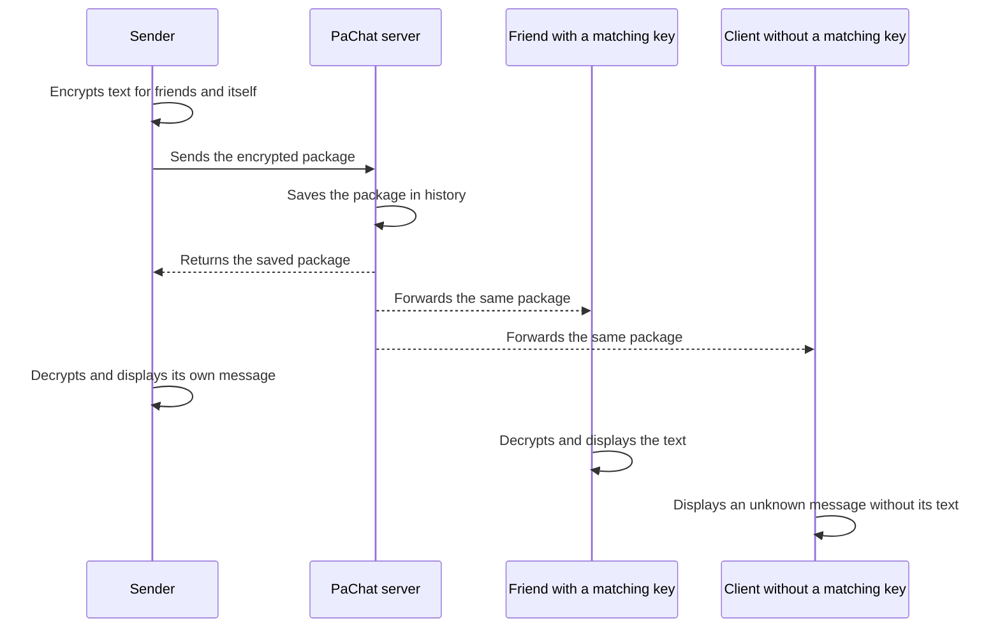
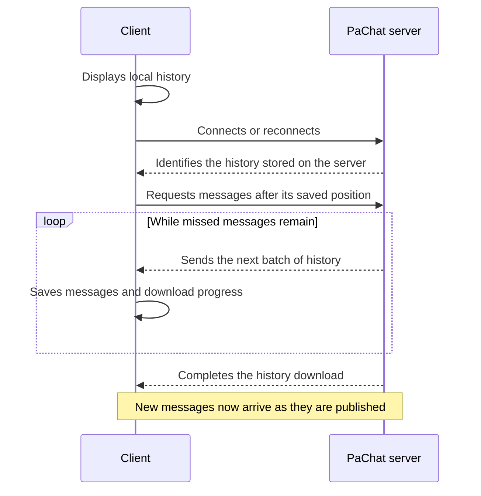

# PaChat

PaChat is an experimental app for exchanging encrypted text messages through your own server. The client runs on Android and Windows. The server stores encrypted messages and forwards them to clients; messages are decrypted on users' devices.

There are no server accounts, registration, or user directory. Friend names, keys, and settings belong to a local profile. To start chatting, participants connect to the same server and exchange public keys through an external channel of their choice.

## Core idea

The server broadcasts each encrypted package to every connected client. Only clients whose keys were included by the sender can read its contents.

In the current version, each message is encrypted for **all added friends' public keys**, as well as for the sender. The app displays a shared message feed rather than separate private conversations. If no friends' keys have been added, only the sender can read the message.

## How a message travels

The server saves each message before broadcasting it. The sender adds the message to its history when the package returns from the server. Delivery receipts for other participants and read receipts are not available yet.

## Getting started

1. Start the server on a computer reachable by all participants. See the [server guide](server/README.md) for instructions.
2. Open the client and enter the server's address and port. A phone needs the server computer's address on a reachable network.
3. Add a friend in **Friends**. The app creates keys for that entry.
4. Send your public key to your friend using **Share public key** or **Copy key**. Your friend can then send messages that you can decrypt.
5. Obtain your friend's public key and add it to the same card using **Add friend's key**. You can now send messages to each other.

Public keys can be shared. Private keys remain on the device and are needed to read messages. The PaChat server does not participate in key exchange.

On Windows, you can create separate local profiles, such as Alice and Bob. Each has its own friends, keys, settings, and history. On Android, the app uses a persistent device profile without a profile selection screen. It connects automatically when server settings have been saved.

## History and reconnection

The client immediately displays history saved on the device, even if the server is temporarily unavailable. After connecting, it requests all missed messages in small batches. If the connection drops during the download, synchronization resumes on the next connection; messages received again are not duplicated.

Both the server and client store history in encrypted form. Restarting the server with the same database preserves its messages. If the server starts using a new database, the client keeps that history separate from the previous one. Older client caches that may contain gaps are automatically synchronized again.

If saving fails, the client displays a warning and lets you retry. Until a save succeeds, new messages remain only in the client's memory and the server's history.

## Background behavior

Message processing does not depend on the chat screen being open. On Android, returning from the chat to the connection screen keeps messages arriving and being saved while the app process is running and the connection is available. The client attempts to reconnect after a connection failure and refreshes the connection when you return to the app.

**Full Android background delivery is not implemented yet.** The system may suspend or terminate the app. Push notifications are not connected yet; missed messages are downloaded on the next successful connection.

Windows system tray support and system notifications are also planned for the future. Currently, leaving a profile closes its connection.

## Keys, backups, and limitations

Keys are protected using operating system facilities. Under **Friends → Encrypted backup**, you can create a password-protected backup of your keys and restore it later. Message history is not included in this backup. Reading encrypted history requires the corresponding private keys.

PaChat is still a prototype. Keep these limitations in mind:

- The server does not receive plaintext, but it can observe connections, network addresses, timing, and package sizes. It does not provide anonymity.
- A friend's displayed name comes from the local key entry. It does not prove the sender's identity: anyone with the corresponding public key can encrypt a message for you.
- Local profiles are not password-protected accounts. Open a given profile in only one running app instance at a time.
- Keys are not automatically synchronized between devices.
- History grows without automatic cleanup. Long-term use requires enough storage on the server and devices.

Update the client and server together: the history transfer format has changed, and new clients require a compatible server.

## Project layout

| Folder | Purpose | Details |
| --- | --- | --- |
| `client/` | Flutter app for Android and Windows | [Client setup, builds, and features](client/README.md) |
| `server/` | Rust server with persistent message history | [Server setup and operation](server/README.md) |

The separate READMEs also cover implementation details, verification commands, and test results. This document describes how the application works as a whole.
